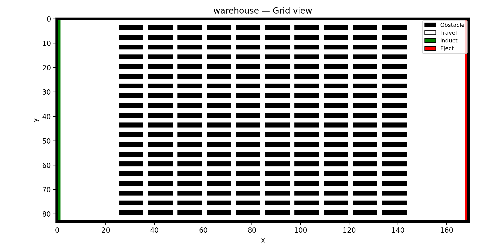
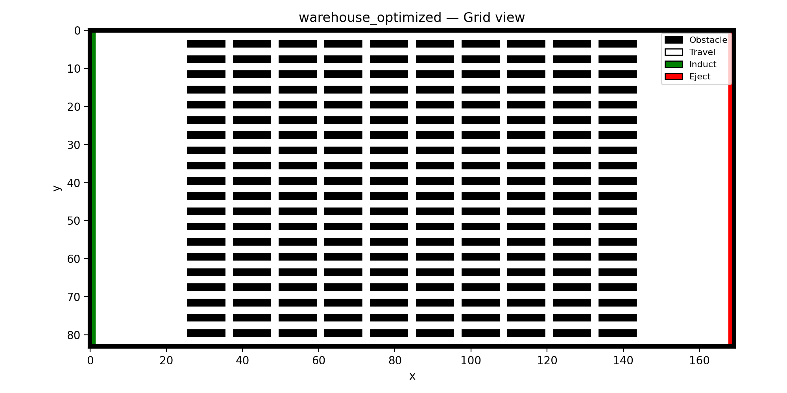
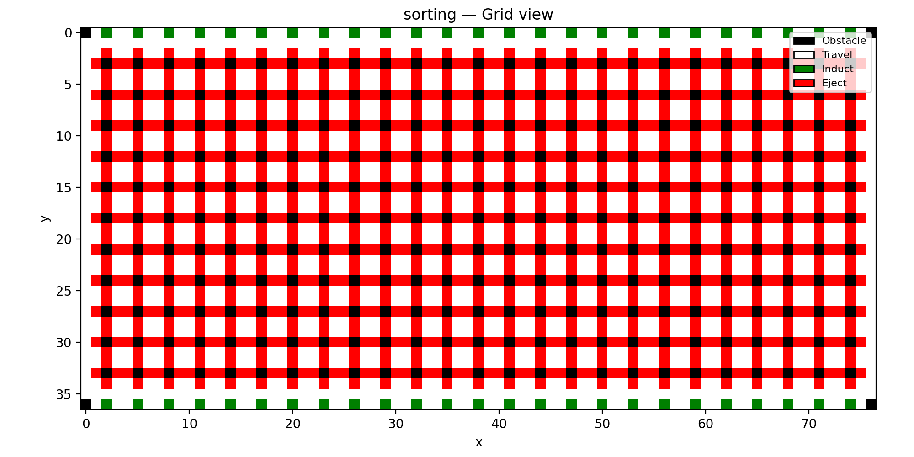
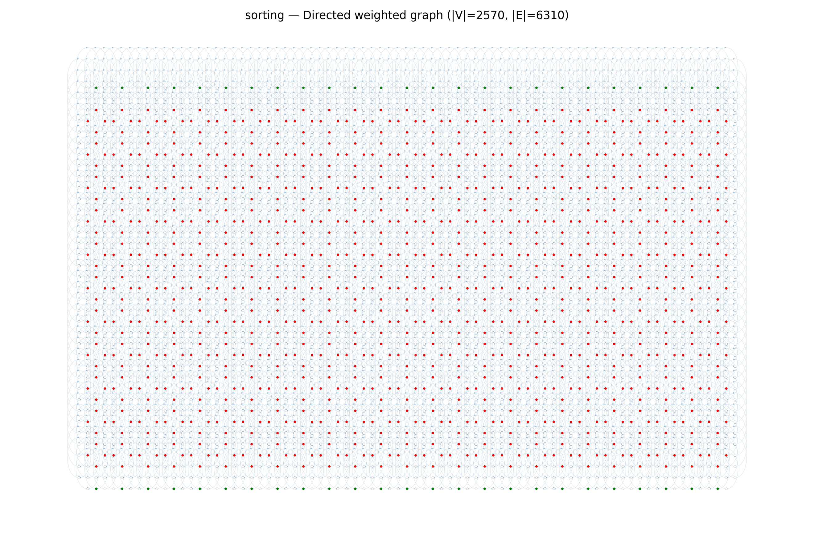
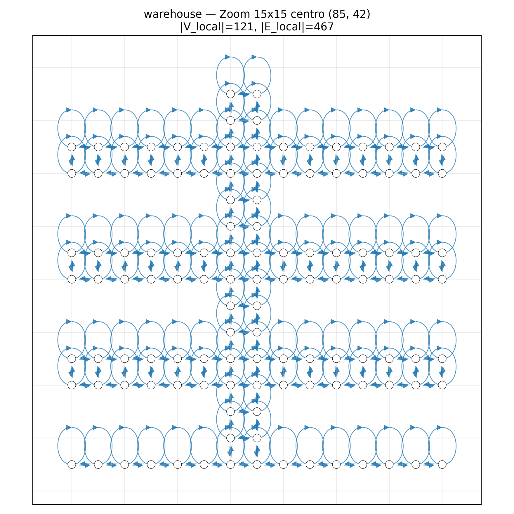
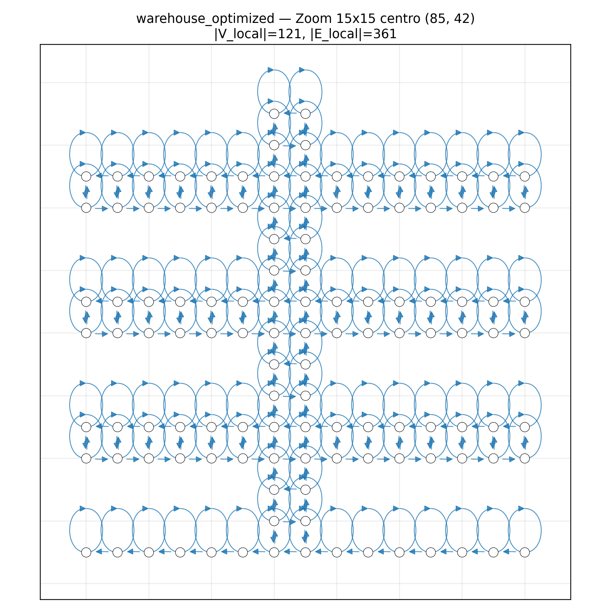
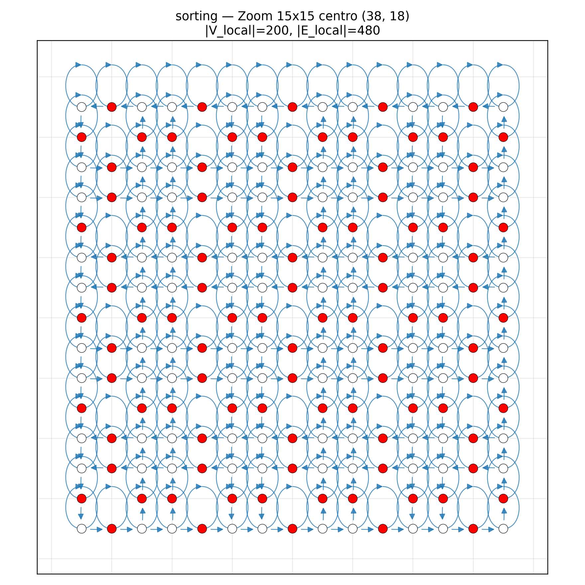

# Impatto della Topologia di Mappa su Conflitti e Throughput nel Lifelong MAPF

## Indice

- [1) Introduzione](#1-introduzione)
- [2) Struttura globale delle mappe](#2-struttura-globale-delle-mappe)
- [3) Connettivita direzionale (archi di movimento)](#3-connettivita-direzionale-archi-di-movimento)
- [4) Profilo di liberta locale (distribuzione out-degree)](#4-profilo-di-liberta-locale-distribuzione-out-degree)
- [5) Differenze puntuali tra warehouse originale e warehouse_optimized](#5-differenze-puntuali-tra-warehouse-originale-e-warehouse_optimized)
- [6) Implicazioni operative per robotica multi-agente](#6-implicazioni-operative-per-robotica-multi-agente)
- [7) Sintesi comparativa finale delle mappe selezionate](#7-sintesi-comparativa-finale-delle-mappe-selezionate)
- [8) Obiettivo Sperimentale: confronto tra solver "stress-oriented" su SORTING](#8-obiettivo-sperimentale-confronto-tra-solver-stress-oriented-su-sorting)
- [9) Nota metodologica](#9-nota-metodologica)
- [10) Appendice visuale](#10-appendice-visuale)

## 1) Introduzione

Questo documento confronta in modo tecnico tre mappe usate negli esperimenti Lifelong MAPF:

- `maps/sorting_map.grid` (nativa)
- `exp/maps/warehouse_map.grid` (warehouse originale MovingAI)
- `maps/warehouse_optimized.grid` (ottimizzazione custom)

Il focus e su:

- struttura e composizione delle celle
- topologia e connettivita direzionale
- differenze tra le due warehouse
- implicazioni operative su percorribilita, conflitti, deadlock e throughput

## 2) Struttura globale delle mappe

| Mappa | Dimensioni | Celle totali | Obstacle | Travel | Induct | Eject |
|---|---:|---:|---:|---:|---:|---:|
| sorting_map | 77 x 37 | 2,849 | 279 (9.793%) | 1,420 (49.842%) | 50 (1.755%) | 1,100 (38.610%) |
| warehouse_map (orig) | 170 x 84 | 14,280 | 4,504 (31.541%) | 9,612 (67.311%) | 82 (0.574%) | 82 (0.574%) |
| warehouse_optimized | 170 x 84 | 14,280 | 4,504 (31.541%) | 9,612 (67.311%) | 82 (0.574%) | 82 (0.574%) |

### Osservazioni chiave:

- Le due warehouse hanno geometria identica: stesso layout, stessi tipi cella, stessi endpoint/stazioni.
- sorting_map ha densita ostacoli molto minore e una quota Eject molto alta, tipica di uno scenario tipo "sorting center" con uscite diffuse.

## 3) Connettivita direzionale (archi di movimento)

Per ogni cella non ostacolo, consideriamo gli archi in N/W/S/E con peso finito.

| Mappa | Archi N | Archi W | Archi S | Archi E | Out-degree medio | Rapporto orizz/vert |
|---|---:|---:|---:|---:|---:|---:|
| sorting_map | 934 | 962 | 934 | 962 | 1.4755 | 1.0300 |
| warehouse_map (orig) | 7,608 | 9,294 | 7,608 | 9,294 | 3.4579 | 1.2216 |
| warehouse_optimized | 9,774 | 4,888 | 9,774 | 4,888 | 2.9996 | 0.5001 |

Nota metrica:

- I valori in tabella sono conteggi diretti dei pesi direzionali nel file `.grid` (analisi locale delle uscite per cella).
- Le metriche di grafo globale (`Numero archi`, `Grado medio`, `Numero SCC`) sono invece quelle calcolate da `analyze_grid_graphs.py` e riportate in appendice/nota metodologica.
- Il `Out-degree medio` di questa sezione (locale, solo uscite) non e confrontabile direttamente con il `Grado medio` NetworkX riportato dallo script (in+out, con contributo dei self-loop WAIT).

### Interpretazione:

- `warehouse_map` originale e molto permissiva (quasi sempre 3-4 uscite per cella).
- `warehouse_optimized` riduce la liberta orizzontale e rafforza la componente verticale.
- `sorting_map` e fortemente vincolata (media 1.48 uscite): rete piu canalizzata, meno opzioni di rerouting locale.

## 4) Profilo di liberta locale (distribuzione out-degree)

Nota rapida sul grado locale:

- grado 1: la cella ha una sola uscita utile (quasi corridoio obbligato)
- grado 2: due uscite (tipico di corridoio o curva)
- grado 3: tre uscite (nodo con una scelta alternativa)
- grado 4: quattro uscite (incrocio completo, massima flessibilita ma anche maggiore conflittualita)

| Mappa | Celle con grado 1 | grado 2 | grado 3 | grado 4 |
|---|---:|---:|---:|---:|
| sorting_map | 1,348 (52.451%) | 1,222 (47.549%) | 0 | 0 |
| warehouse_map | 0 | 4 (0.041%) | 5,292 (54.133%) | 4,480 (45.827%) |
| warehouse_optimized | 0 | 4 (0.041%) | 9,772 (99.959%) | 0 |

Nota relativa a valori '0' nelle colonne grado 1-4:

- Un valore `0` in una colonna non indica un errore, ma che in quella mappa non esistono celle con quel grado.
- Se `grado 1 = 0`, non ci sono vicoli obbligati terminali: in media la rete e piu ridondante localmente.
- Se `grado 4 = 0`, non ci sono incroci completi a quattro uscite: diminuisce la conflittualita nei crossing, ma anche la massima liberta di scelta istantanea.
- Se `grado 3 = 0` (come in `sorting_map`), la rete e quasi solo corridoi/curve (gradi 1-2): traffico piu disciplinato ma minore flessibilita di rerouting.

### Interpretazione finale:

- `warehouse_map` e "high-branching": molte celle a 4 uscite.
- `warehouse_optimized` e quasi completamente "grado 3": elimina i nodi a 4 uscite, riducendo i conflitti di crossing.
- `sorting_map` lavora in regime "grado 1-2": massima disciplina di flusso, minima flessibilita locale.

## 5) Differenze puntuali tra warehouse originale e warehouse_optimized

Confronto cella-per-cella (stesso id, stessa posizione):

- Celle con tipo cambiato: `0`
- Celle mobili con almeno una direzione cambiata: `9,212 / 9,776` (94.231%)

Variazioni direzionali aggregate:

- NORTH: `+2,166` archi (inf -> finito)
- SOUTH: `+2,166` archi (inf -> finito)
- WEST: `-4,406` archi netti (4,606 finito->inf, 200 inf->finito)
- EAST: `-4,406` archi netti (4,606 finito->inf, 200 inf->finito)

Messaggio topologico:

- Non e una modifica locale, ma globale della dinamica di traffico.
- La mappa ottimizzata converte la rete da "quasi bidirezionale densa" a "semi-lane" con priorita verticale e lateralita selettiva.

## 6) Implicazioni operative per robotica multi-agente

### 6.1 Liberta di percorribilita

- `warehouse_map`:
  - pro: piu alternative locali, path spesso piu corto a bassa densita.
  - contro: molte scelte simultanee equivalenti, quindi maggior probabilita di conflitti competitivi.
- `warehouse_optimized`:
  - pro: meno ambiguita decisionale locale, flusso piu ordinato.
  - contro: meno opzioni di bypass immediato in caso di blocco locale.
- `sorting_map`:
  - pro: instradamento molto prevedibile.
  - contro: alta dipendenza da pochi corridoi critici (minor resilienza ai blocchi puntuali).

### 6.2 Conflitti e deadlock

- Nella warehouse originale, i nodi a 4 uscite e i corridoi laterali bidirezionali favoriscono:
  - head-on conflicts
  - swap conflicts
  - congestione in incrocio
- Nella warehouse ottimizzata, la riduzione degli archi laterali e la regolarizzazione a grado 3:
  - abbassano i conflitti frontali orizzontali
  - riducono la pressione sui conflict resolver locali
  - diminuiscono il rischio di deadlock strutturali

### 6.3 Throughput atteso

In regime ad alta densita agenti:

- `warehouse_optimized` tende ad avere throughput piu stabile, perche limita i conflitti distruttivi.
- `warehouse_map` puo essere competitivo a bassa/media densita (path piu liberi), ma degrada piu rapidamente quando aumenta l'interferenza tra agenti.
- `sorting_map` e pensata per flussi disciplinati: throughput robusto se il task assignment rispetta la struttura; puo soffrire quando i colli di bottiglia vengono saturati.

### 6.4 Impatto su solver RHCR (PBS/ECBS/WHCA)

- PBS: beneficia di mappe con conflitti "strutturati" (optimized/sorting), perche l'ordinamento delle priorita genera meno inversioni critiche.
- ECBS: robusto in tutti i casi, ma su mappe molto permissive puo spendere tempo nel disambiguare troppe alternative equivalenti.
- WHCA: tipicamente il piu sensibile ai choke points e ai conflitti frontali; migliora sensibilmente quando la topologia impone flussi piu ordinati (optimized).

## 7) Sintesi comparativa finale delle mappe selezionate

- `sorting_map.grid` (nativa):
  - topologia molto direzionale e vincolata
  - massima disciplina del traffico, minima flessibilita locale
- `warehouse_map.grid` (originale MovingAI):
  - geometria ampia ma altamente ramificata
  - elevata liberta locale, maggiore esposizione a conflitti in congestione
- `warehouse_optimized.grid` (ottimizzazione custom):
  - stessa geometria dell'originale, ma con connettivita riprogettata
  - riduce in modo netto la liberta orizzontale, aumenta la regolarita del flusso
  - migliore compromesso pratico per scenari ad alta densita: meno deadlock, maggiore stabilita del throughput

## 8) Obiettivo Sperimentale: confronto tra solver "stress-oriented" su SORTING

Nel paradigma SORTING il ciclo operativo e tipicamente:

- prelievo da area Induct
- trasporto verso area Eject
- ritorno in rete per assegnazione successiva

In robotica di magazzino questo implica due criticita principali:

- stabilita del flusso bidirezionale (andata/ritorno) sotto carico
- robustezza del sistema in presenza di code locali presso stazioni e incroci

### 8.1 sorting_map.grid (mappa nativa SORTING)

Profilo operativo:

- layout gia orientato a instradamento disciplinato
- alta quota di celle Eject distribuite
- rete con gradi bassi (1-2), quindi comportamento molto prevedibile

#### Implicazioni:

- ottima baseline per misurare throughput in condizioni ben strutturate
- rischio principale: saturazione di pochi choke points se l'assegnazione task non bilancia bene le uscite
- minore capacita di assorbire perturbazioni locali, perche le alternative di rerouting sono poche

### 8.2 warehouse_map.grid (originale) in scenario SORTING

Profilo operativo:

- rete ampia e molto ramificata (molti nodi grado 3-4)
- maggiore liberta locale di scelta percorso
- assenza di disciplina direzionale forte nei tratti laterali

#### Implicazioni:

- a basso carico puo ottenere percorsi mediamente efficienti
- ad alto carico cresce rapidamente la conflittualita (head-on e crossing), con impatto su latenze e stabilita
- in SORTING tende a mostrare varianza maggiore del throughput tra run/semi diversi

### 8.3 warehouse_optimized.grid (ottimizzazione custom) in scenario SORTING

Profilo operativo:

- stessa geometria fisica dell'originale, ma con connettivita direzionale piu regolare
- riduzione sistematica della lateralita e rinforzo di flussi piu ordinati
- quasi totale eliminazione dei nodi a grado 4

#### Implicazioni:

- riduzione dei conflitti distruttivi nei crossing
- comportamento piu stabile nel regime congestionato
- throughput mediamente piu robusto al crescere del numero di agenti
- trade-off: meno scorciatoie locali, quindi alcuni task possono allungarsi in condizioni leggere

### 8.4 Lettura comparativa per decisione sperimentale

- usare `sorting_map.grid` come benchmark di riferimento strutturato
- usare `warehouse_map.grid` per testare robustezza in ambiente ad alta liberta ma alta conflittualita
- usare `warehouse_optimized.grid` per valutare l'effetto di una progettazione topologica orientata alla scalabilita operativa

In pratica:

- `sorting_map.grid` misura bene l'efficienza in rete canalizzata
- `warehouse_map.grid` misura la capacita del solver di gestire caos e interferenza
- `warehouse_optimized.grid` misura il compromesso migliore tra flessibilita e stabilita di throughput

Questa triade è particolarmente utile ai fini di dimostrare che la performance non dipende solo dal solver, ma anche dalla co-progettazione tra algoritmo e topologia di traffico.

## 9) Nota metodologica

Le metriche riportate sono state ottenute in due modi complementari:

- conteggi diretti dai file `.grid` (tipi cella, pesi direzionali N/W/S/E, distribuzione out-degree locale, diff cella-per-cella tra warehouse originale e ottimizzata)
- analisi di grafo con script `analyze_grid_graphs.py` (nodi, archi del grafo diretto, grado medio NetworkX, numero di SCC)

Comando usato per i valori di grafo globale:

`py analyze_grid_graphs.py`

Valori coerenti con l'output script:

- warehouse: `|V|=9776`, `|E|=43580`, grado medio `8.9157`, SCC `1`
- warehouse_optimized: `|V|=9776`, `|E|=34368`, grado medio `7.0311`, SCC `1`
- sorting: `|V|=2570`, `|E|=6310`, grado medio `4.9105`, SCC `183`

Questo rende il confronto riproducibile e chiarisce la differenza tra metriche locali sui pesi e metriche globali sul grafo costruito dallo script.

Nota finale sulle metriche di grado:

- `Out-degree medio` (sezione 3) descrive la liberta di movimento locale dai pesi N/W/S/E.
- `Grado medio` (sezione 9, script) descrive la connettivita del grafo diretto costruito da NetworkX.
- I due indicatori sono complementari, ma non vanno confrontati numericamente in modo diretto.

## 10) Appendice visuale

Le immagini seguenti supportano le conclusioni topologiche del documento.

### 10.1 Vista griglia (struttura celle)

Warehouse originale:

Warehouse ottimizzata:

Sorting:

### 10.2 Vista grafo diretto completo (densita archi)

Warehouse originale:

Warehouse ottimizzata:

Sorting:

### 10.3 Zoom locale 15x15 (confronto direzionalita)

Warehouse originale (maggiore numero di archi locali):

Warehouse ottimizzata (riduzione archi laterali e flusso piu regolare):

Sorting (pattern locale dedicato allo scenario SORTING):

### 10.4 Artefatti GraphML

I grafi machine-readable per ulteriori analisi sono disponibili in:

- [sorting.graphml](../maps/maps_graphs/sorting.graphml)
- [warehouse.graphml](../maps/maps_graphs/warehouse.graphml)
- [warehouse_optimized.graphml](../maps/maps_graphs/warehouse_optimized.graphml)