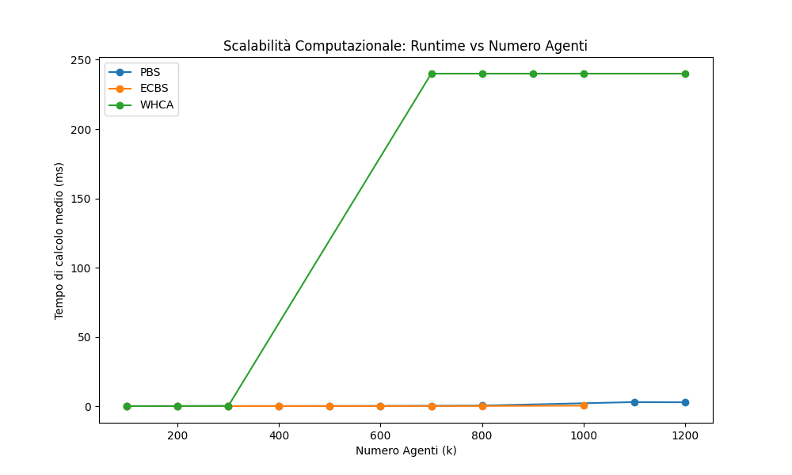
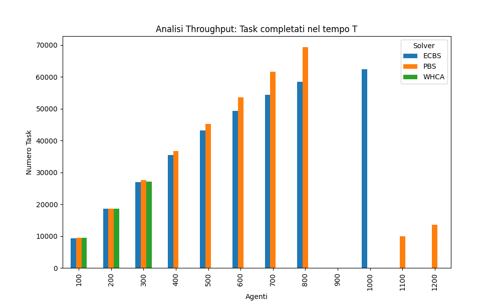

# SORTING_MAP - Analisi Tecnica Ufficiale (final_comparison)

## Indice

- [1) Perimetro analisi ufficiale](#1-perimetro-analisi-ufficiale)
- [2) Setup sperimentale e contesto RHCR](#2-setup-sperimentale-e-contesto-rhcr)
- [2.1 Scenario e mappa](#21-scenario-e-mappa)
- [2.2 Configurazioni testate](#22-configurazioni-testate)
- [2.3 Nota metodologica sui dati ufficiali](#23-nota-metodologica-sui-dati-ufficiali)
- [3) Risultati ufficiali: final_comparison](#3-risultati-ufficiali-final_comparison)
- [3.1 Quadro globale per solver](#31-quadro-globale-per-solver)
- [3.2 Lettura per fasce di carico](#32-lettura-per-fasce-di-carico)
- [3.3 Configurazioni A/B ottimali mantenute](#33-configurazioni-ab-ottimali-mantenute)
- [4) Interpretazione robotica dei risultati](#4-interpretazione-robotica-dei-risultati)
- [5) Criterio decisionale operativo](#5-criterio-decisionale-operativo)
- [6) Integrazione grafici risultati SORTING](#6-integrazione-grafici-risultati-sorting)
- [7) Esperimenti rilevanti con Visualizer](#7-esperimenti-rilevanti-con-visualizer)

## 1) Perimetro analisi ufficiale

Questa analisi utilizza esclusivamente i risultati ufficiali presenti in:

- exp/stress_test_sorting_map/final_comparison/final_report.csv
- exp/stress_test_sorting_map/final_comparison/final_report_summary.csv

Non vengono considerati, per la valutazione conclusiva, i risultati storici delle campagne precedenti.

## 2) Setup sperimentale e contesto RHCR

### 2.1 Scenario e mappa

- Scenario: SORTING
- Mappa: maps/sorting_map.grid
- Dimensioni: 77 x 37 (2849 celle)
- Conteggi celle:
  - Travel: 1420
  - Eject: 1100
  - Induct: 50
  - Obstacle: 279

Interpretazione tecnica: la mappa presenta un elevato numero di endpoint (Induct/Eject) e corridoi regolari; in regime congestionato diventa quindi centrale la capacita del solver di preservare produttivita e stabilita del flusso.

### 2.2 Configurazioni testate

Nella cartella final_comparison sono state mantenute le configurazioni operative ritenute ottimali per ciascun solver principale:

- PBS: h=5, w=5 (configurazione B)
- ECBS: h=5, w=10 (configurazione A)
- WHCA: h=5, w=10

Ulteriori impostazioni osservate dai risultati ufficiali:

- Seed: 42
- Intervallo agenti: 100, 200, ..., 1200
- Vincolo RHCR rispettato: w >= h
- Timeout run osservato nei dati: 240 s

### 2.3 Nota metodologica sui dati ufficiali

Nel file summary ogni punto ha Runs=1; di conseguenza Runtime_Std e Throughput_Std risultano pari a 0 e Success_Rate coincide con esito binario del singolo run.

## 3) Risultati ufficiali: final_comparison

### 3.1 Quadro globale per solver

Status aggregati (da final_report.csv):

- PBS: 10 Success, 2 Timeout
- ECBS: 9 Success, 3 Timeout
- WHCA: 8 Success, 3 Timeout, 1 Fail

Success_Rate medio sui 12 livelli di carico (da final_report_summary.csv):

- PBS: 0.833
- ECBS: 0.750
- WHCA: 0.667

Osservazione tecnica: il solo Success_Rate risulta non sufficiente per WHCA in alta densita, poiche alcuni successi presentano throughput quasi nullo con runtime al limite (240 s).

### 3.2 Lettura per fasce di carico

Fascia 100-300 (regime stabile):

- Tutti i solver hanno successo.
- ECBS e il migliore per runtime.
- PBS e allineato in robustezza, con throughput leggermente maggiore su 200-300.
- WHCA e operativo ma computazionalmente piu costoso.

Fascia 400-800 (transizione e pre-critica):

- PBS e ECBS restano stabili su tutta la fascia.
- PBS mostra throughput sistematicamente superiore a ECBS in questa configurazione comparativa.
- WHCA entra in crisi da 400 a 600 (timeout), successivamente viene classificato formalmente come Success a 700-800, ma con throughput molto basso (2 e 8) e runtime fisso a 240 s.

Fascia 900-1200 (regime critico):

- k=900: PBS timeout, ECBS timeout, WHCA success formale con throughput 1 (non operativo).
- k=1000: ECBS success con throughput elevato (62369); PBS timeout; WHCA throughput 1.
- k=1100-1200: PBS viene nuovamente classificato come Success, ma con throughput fortemente ridotto (9898 e 13494); ECBS timeout; WHCA fail/throughput marginale.

Sintesi di robustezza in zona critica:

- non emerge un vincitore unico su 900-1200;
- ECBS domina il punto k=1000;
- PBS recupera parzialmente a 1100-1200, ma con prestazioni degradate;
- WHCA non fornisce produttivita industrialmente utilizzabile in questa fascia.

### 3.3 Configurazioni A/B ottimali mantenute

I risultati ufficiali confermano la scelta di mantenere configurazioni differenziate per solver:

- Configurazione A (ECBS, h=5, w=10): massimizza la tenuta di ECBS nella fascia alta fino a k=1000.
- Configurazione B (PBS, h=5, w=5): mantiene PBS competitivo su un ampio intervallo e consente recupero di successo a carico molto elevato (1100-1200), pur con throughput ridotto.

Conclusione metodologica RHCR: in SORTING non esiste un unico valore di w ottimale per tutti i solver; la scelta solver-specifica di (h,w) rimane necessaria.

## 4) Interpretazione robotica dei risultati

Implicazioni operative principali:

1. Regime nominale (100-800): PBS ed ECBS sono entrambi affidabili; ECBS minimizza costo computazionale, PBS massimizza throughput.
2. Regime critico (>=900): il sistema entra in una zona di elevata sensibilita topologica e temporale; piccoli cambiamenti di lookahead e solver producono inversioni di performance.
3. WHCA: presenta successi nominali non accompagnati da produttivita reale (throughput molto basso), quindi richiede criterio di accettazione basato su throughput minimo e non solo su status.

## 5) Criterio decisionale operativo

Per la campagna ufficiale final_comparison su sorting_map:

1. Per k <= 800:
   - adottare ECBS (A: h=5,w=10) come configurazione di riferimento per efficienza runtime;
   - mantenere PBS (B: h=5,w=5) come alternativa robusta con throughput elevato.
2. Per 900 <= k <= 1000:
   - considerare ECBS (A) come prima scelta, poiche PBS collassa a 900-1000 nei dati ufficiali.
3. Per k >= 1100:
   - nessun solver mantiene contemporaneamente alta robustezza e alta produttivita;
   - PBS (B) e l'unico che recupera successi, ma in modalita degradata.
4. WHCA:
   - non raccomandato per impiego operativo nel regime medio-alto/alto senza retuning strutturale.

## 6) Integrazione grafici risultati SORTING

Di seguito sono integrati i grafici ufficiali presenti nella cartella risultati della campagna:

- exp/stress_test_sorting_map/final_comparison/chart_runtime.png
- exp/stress_test_sorting_map/final_comparison/chart_throughput.png

### 6.1 Scalabilita computazionale (Runtime vs Numero Agenti)



Interpretazione tecnica:

- ECBS mantiene il profilo runtime piu contenuto e regolare nella fascia operativa principale (100-800), coerente con il ruolo di baseline A (h=5,w=10).
- PBS mostra crescita progressiva del costo computazionale, ma resta in zona operativa fino a 800; in alta densita compaiono discontinuita legate ai timeout (900-1000) e al successivo recupero parziale (1100-1200).
- WHCA evidenzia una saturazione netta a 240 s da k=700 in avanti: il comportamento e compatibile con una pianificazione intrinsecamente non scalabile in regime congestionato.

Interpretazione sistemica:

- il grafico non rappresenta solo velocita del solver, ma anche stabilita del controllo rolling-horizon sotto carico;
- quando il runtime tende al limite di timeout, la qualita del servizio degrada anche in presenza di status formale Success.

### 6.2 Produttivita operativa (Throughput su orizzonte T)



Interpretazione tecnica:

- tra 100 e 800 agenti, PBS e ECBS garantiscono throughput elevato e crescente; PBS risulta sistematicamente superiore in volume task completati nella configurazione comparata.
- a 900 agenti emerge una rottura di regime: PBS ed ECBS non mantengono servizio (timeout), mentre WHCA resta formalmente attivo ma con throughput ~1, quindi non operativo.
- a 1000 agenti ECBS recupera throughput elevato (62369), confermando che la configurazione A resta la migliore per ECBS nella zona alta.
- a 1100-1200 PBS recupera successi ma con throughput molto ridotto rispetto al plateau precedente; questo segnala modalita degradata, non piena continuita di servizio.

Analisi dettagliata del caso k=900:

- PBS (`w=5`) ed ECBS (`w=10`) risultano entrambi in timeout nel report ufficiale, con throughput registrato pari a 0.
- Nei rispettivi `solver.csv` sono presenti molte iterazioni di pianificazione, ma il run non completa il ciclo simulativo entro il limite temporale: questo indica saturazione del processo di replanning, non assenza di attivita del solver.
- WHCA e marcato come `Success`, ma produce throughput pari a 1 con runtime a 240 s: sul piano operativo rappresenta un successo nominale senza produttivita utile.
- In termini robotici, k=900 rappresenta un punto di biforcazione del sistema: la congestione trasforma il collo di bottiglia da puro conflitto locale a instabilita globale del ciclo rolling-horizon (propagazione code, ritardi cumulativi, perdita di continuita nel completamento task).

Interpretazione sistemica:

- il grafico throughput rende esplicito che il criterio di accettazione deve combinare Success, runtime e task completati;
- WHCA costituisce il caso tipico di disallineamento tra successo nominale e produttivita reale.

### 6.3 Sintesi congiunta dei due grafici

La lettura combinata runtime-throughput conferma la scelta solver-specifica delle configurazioni A/B:

- ECBS (A: h=5,w=10) come riferimento di efficienza computazionale e robustezza fino alla fascia alta (con migliore tenuta al punto k=1000);
- PBS (B: h=5,w=5) come alternativa ad alta produttivita in fascia nominale e con recupero parziale oltre la soglia critica;
- WHCA non idoneo a impiego operativo in alta densita in assenza di retuning sostanziale.

### 6.4 Nota metodologica finale sul criterio di successo

Nel percorso sperimentale e stato introdotto un aggiornamento metodologico rilevante: il successo non e stato piu interpretato come semplice stato restituito dal processo, ma come successo robusto basato su produttivita reale.

In pratica, sia in final_stress_test.py (SORTING) sia in warehouse_final_stress_test.py (WAREHOUSE) il run viene considerato Success solo se:

- throughput > 0 (task effettivamente completati);
- runtime medio valido (non NaN) da solver.csv.

La ragione dell'adozione su due script distinti non e una differenza di principio nel criterio, ma una differenza di ruolo sperimentale:

- final_stress_test.py e stato usato sul benchmark sorting_map come base di riferimento controllata, utile a calibrare la metodologia e identificare i falsi positivi di successo nominale;
- warehouse_final_stress_test.py e stato poi usato sul contesto warehouse realistico, mantenendo lo stesso criterio robusto per garantire confrontabilita scientifica e evitare sovrastime prestazionali in regime congestionato.

Questa scelta e coerente con l'impostazione dell'analisi: partire da una mappa benchmark (sorting_map) per validare il metodo, quindi trasferire la stessa regola di valutazione al caso realistico warehouse, dove gli effetti di congestione e degrado operativo sono ancora piu critici.

## 7) Esperimenti rilevanti con Visualizer

La seguente selezione include run rappresentativi per analizzare regime stabile, regime pre-critico e regime critico con il visualizer.

### 7.1 Baseline stabile (confronto diretto PBS vs ECBS)

```powershell
cd visualizer
python visualize_experiment.py "../exp/stress_test_sorting_map/final_comparison/ECBS_k300_seed42_w10_h5"
python visualize_experiment.py "../exp/stress_test_sorting_map/final_comparison/PBS_k300_seed42_w5_h5"
```

### 7.2 Fascia pre-critica ad alta produttivita

```powershell
cd visualizer
python visualize_experiment.py "../exp/stress_test_sorting_map/final_comparison/ECBS_k800_seed42_w10_h5"
python visualize_experiment.py "../exp/stress_test_sorting_map/final_comparison/PBS_k800_seed42_w5_h5"
```

### 7.3 Ingresso nel regime critico (punto di biforcazione)

```powershell
cd visualizer
python visualize_experiment.py "../exp/stress_test_sorting_map/final_comparison/ECBS_k1000_seed42_w10_h5"
```

### 7.4 Regime degradato ad alta densita (recupero parziale PBS)

```powershell
cd visualizer
python visualize_experiment.py "../exp/stress_test_sorting_map/final_comparison/PBS_k1100_seed42_w5_h5"
python visualize_experiment.py "../exp/stress_test_sorting_map/final_comparison/PBS_k1200_seed42_w5_h5"
```

### 7.5 Nota operativa

Alcuni run in timeout (ad esempio k=900 per PBS ed ECBS) non includono l'insieme completo di file necessari alla ricostruzione visuale dettagliata (config.txt, paths.txt, tasks.txt). In tali casi, l'analisi deve essere condotta prioritariamente sui report aggregati e sui log numerici.

### 7.6 Nota piattaforma e criterio CPU-based

- Benchmark del paper (riferimento): piattaforma Amazon EC2 m4.xlarge con 16 GB RAM (il paper non specifica un modello CPU puntuale, ma una classe di istanza cloud).
- Campagna sperimentale di questo documento: test eseguiti su CPU 12th Gen Intel Core i7-12700H (14 core, 20 thread; frequenza base 2.30 GHz, turbo fino a 4.7 GHz).
- Motivazione tecnica del criterio CPU-based: nel codice di partenza usato in questa campagna non era disponibile un percorso nativo di esecuzione su GPU (nessun backend CUDA/OpenCL integrato e nessun offloading dei solver). Di conseguenza, il calcolo resta interamente su CPU.
- Chiarimento operativo: l'uso della GPU non era disponibile out-of-the-box nel workflow adottato; sarebbe stato necessario sviluppare e integrare esplicitamente un backend GPU dedicato.
- Implicazione metodologica: i runtime riportati riflettono il comportamento della piattaforma CPU/memoria della macchina di test e non sono confrontabili in valore assoluto con quelli del benchmark cloud del paper.
