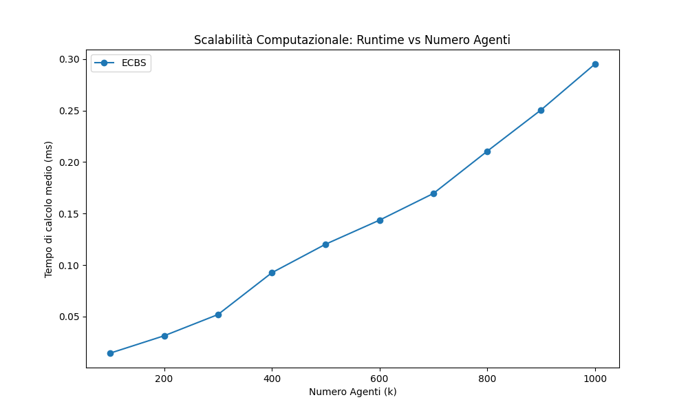
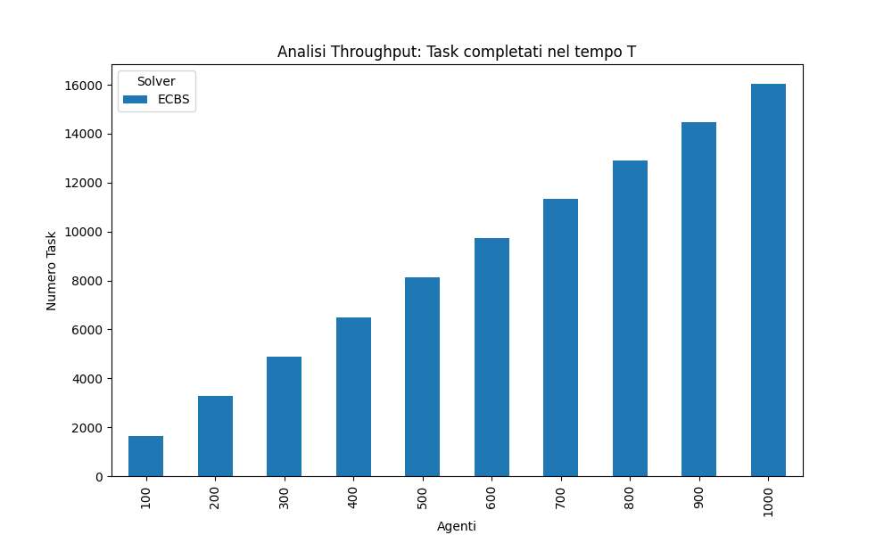
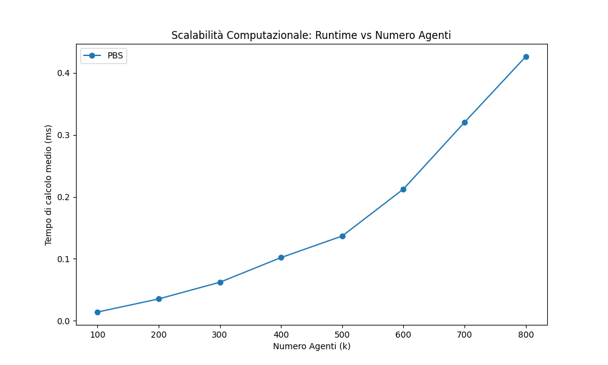
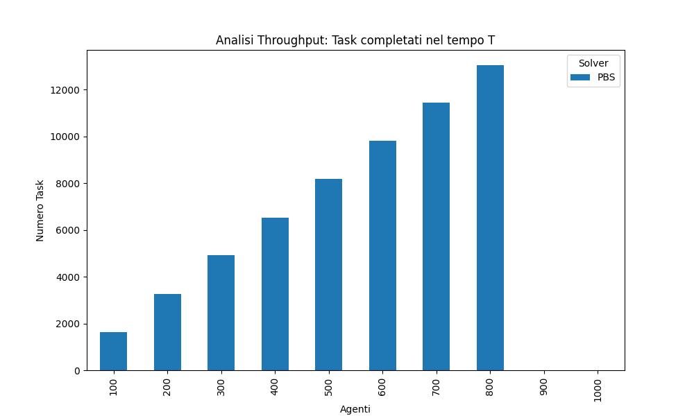
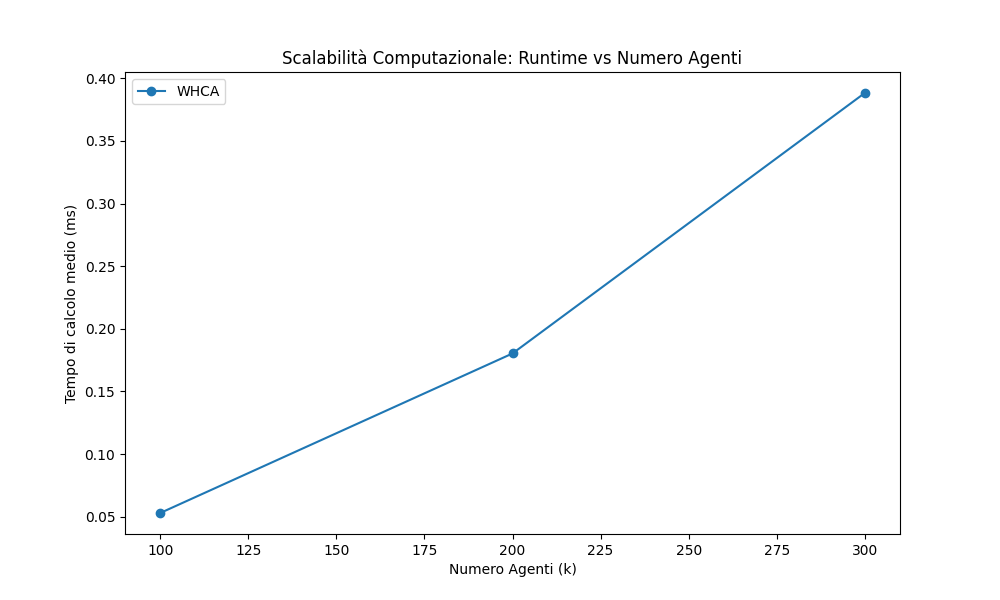
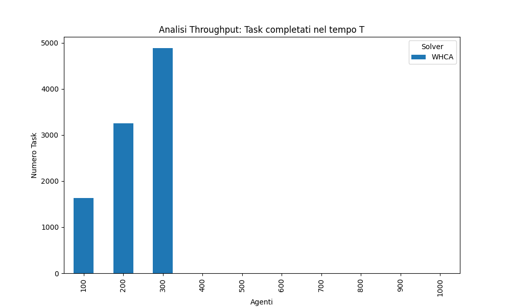
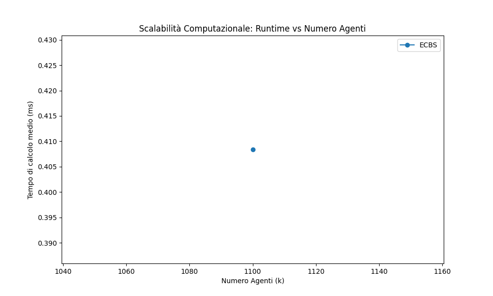
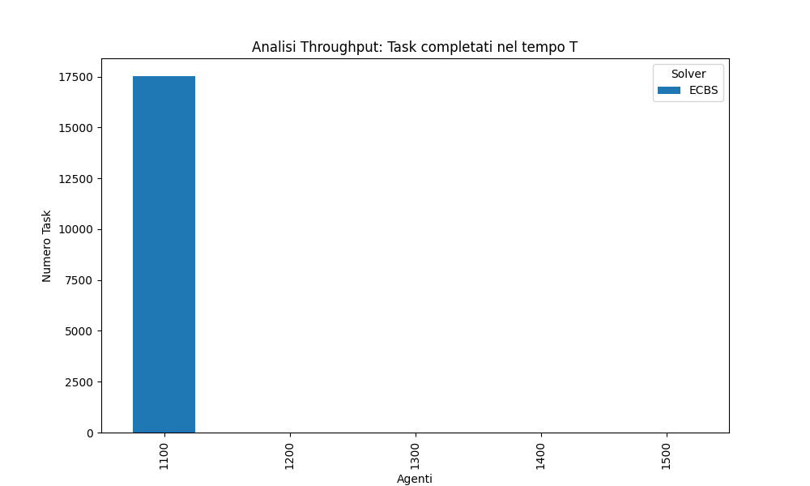

# WAREHOUSE MAP - Analisi sperimentale RHCR su Warehouse

## Indice

- [1) Obiettivo del documento](#1-obiettivo-del-documento)
- [2) Esperimento originale del paper (ricostruzione tecnica)](#2-esperimento-originale-del-paper-ricostruzione-tecnica)
- [2.1 Impianto metodologico generale](#21-impianto-metodologico-generale)
- [2.2 Dettagli sperimentali globali nel paper](#22-dettagli-sperimentali-globali-nel-paper)
- [2.3 Applicazione A: Fulfillment warehouse](#23-applicazione-a-fulfillment-warehouse)
- [2.4 Applicazione B: Sorting center warehouse-like](#24-applicazione-b-sorting-center-warehouse-like)
- [2.5 Esperimento addizionale con orizzonte dinamico](#25-esperimento-addizionale-con-orizzonte-dinamico)
- [3) Lettura tecnica per scenario SORTING su warehouse](#3-lettura-tecnica-per-scenario-sorting-su-warehouse)
- [3.1 Sezione dedicata a warehouse_map.grid (mappa MovingAI)](#31-sezione-dedicata-a-warehouse_mapgrid-mappa-movingai)
- [3.2 Sezione dedicata a warehouse_optimized.grid (ottimizzazione custom della mappa MovingAI)](#32-sezione-dedicata-a-warehouse_optimizedgrid-ottimizzazione-custom-della-mappa-movingai)
- [3.3 Conclusione operativa del paragrafo 3](#33-conclusione-operativa-del-paragrafo-3)
- [4) Analisi risultati finali su warehouse_optimized](#4-analisi-risultati-finali-su-warehouse_optimized)
- [4.1 Perimetro sperimentale considerato](#41-perimetro-sperimentale-considerato)
- [4.2 Confronto solver nel range 100-1000](#42-confronto-solver-nel-range-100-1000)
- [4.3 Estensione ECBS nel range 1100-1500](#43-estensione-ecbs-nel-range-1100-1500)
- [4.4 Sintesi tecnico-operativa](#44-sintesi-tecnico-operativa)
- [5) Integrazione grafici ufficiali della campagna warehouse](#5-integrazione-grafici-ufficiali-della-campagna-warehouse)
- [5.1 ECBS - range 100-1000 (w=15, h=5)](#51-ecbs---range-100-1000-w15-h5)
- [5.2 PBS - range 100-1000 (w=15, h=5)](#52-pbs---range-100-1000-w15-h5)
- [5.3 WHCA - range 100-1000 (w=30, h=5)](#53-whca---range-100-1000-w30-h5)
- [5.4 ECBS - range 1100-1500 (w=15, h=5)](#54-ecbs---range-1100-1500-w15-h5)
- [6) Analisi avanzata di robotica operativa](#6-analisi-avanzata-di-robotica-operativa)
- [7) Esperimenti rilevanti con Visualizer](#7-esperimenti-rilevanti-con-visualizer)

## 1) Obiettivo del documento

Questo documento ha tre scopi:

- ricostruire in modo fedele e tecnico come sono stati impostati gli esperimenti originali del paper Lifelong Multi-Agent Path Finding in Large-Scale Warehouses;
- definire una strategia sperimentale aggiornata, specifica per la mappa warehouse_map, per ottenere un compromesso robusto tra stabilita, throughput e costo computazionale.
- documentare l'implementazione effettiva della campagna sperimentale su warehouse_optimized, includendo criteri di successo, limiti operativi osservati e condizioni di riproducibilita.

## 2) Esperimento originale del paper (ricostruzione tecnica)

## 2.1 Impianto metodologico generale

Nel paper, gli autori introducono RHCR (Rolling-Horizon Collision Resolution), che decompone il lifelong MAPF in episodi Windowed MAPF.

Due parametri governano il comportamento:

- w: time horizon su cui si impone collision-free;
- h: replanning period (frequenza di replanning).

Vincolo strutturale del framework:

- w >= h.

Interpretazione robotica:

- h piccolo aumenta reattivita ma anche overhead di pianificazione;
- w grande aumenta lookahead conflitti, ma puo aumentare tempi di calcolo e introdurre attese non necessarie;
- esiste una regione di trade-off in cui throughput resta alto e runtime resta gestibile.

## 2.2 Dettagli sperimentali globali nel paper

- Simulazione: 5000 timestep per esperimento.
- Potenziale anti-deadlock usato nelle prove principali: p=1.
- Piattaforma: Amazon EC2 m4.xlarge, 16 GB RAM.
- Solvers Windowed MAPF testati in RHCR:
  - PBS
  - ECBS
  - CA*
  - CBS
- Risultato di scalabilita riportato: fino a 1000 agenti (circa 38.9% delle celle libere nella mappa usata).

## 2.3 Applicazione A: Fulfillment warehouse

Caratteristiche setup:

- Mappa: 33x46, 4-neighbor, circa 16% ostacoli.
- Inizializzazione agenti: uniforme random su celle valide specifiche.
- Task assignment: goal scelti con regole semplici domain-specific descritte nel paper.
- Parametri RHCR usati nel confronto principale:
  - h=5
  - w=20
- Baseline confrontate:
  - Holding Endpoints (HE)
  - Reserving Dummy Paths (RDP)
- Solver usato in quel confronto: PBS.

Risultato tecnico principale:

- RHCR migliora throughput rispetto a HE/RDP nelle condizioni testate;
- il costo per singola chiamata planner puo essere maggiore, ma con migliore risultato sistemico (meno idle, migliore produttivita).

## 2.4 Applicazione B: Sorting center warehouse-like

Caratteristiche setup:

- Mappa: 37x77, 4-neighbor, circa 10% ostacoli.
- Struttura endpoint/task con stazioni e chutes distribuiti.
- Mappa resa direzionale per ridurre swapping conflicts e focalizzare l'analisi sull'efficienza del framework.
- Parametro fisso:
  - h=5
- Parametro variato:
  - diversi valori di w (incluso confronto con orizzonte molto grande).
- Solver valutati:
  - PBS
  - ECBS (fattore di subottimalita 1.1)
  - CA*
  - CBS

Risultati tecnici principali:

- throughput poco sensibile a w in ampia parte dei casi;
- runtime molto sensibile a w (riduzioni anche marcate con w piu piccolo);
- la riduzione controllata di w migliora scalabilita pratica senza degradare fortemente il throughput.

## 2.5 Esperimento addizionale con orizzonte dinamico

Gli autori testano un adattamento dinamico di w guidato dal potenziale p.

Esempio riportato (configurazione specifica del paper):

- partenza con w=5;
- soglia potenziale alta (esempio p=60 in quella sezione);
- solver ECBS con bound 1.5;
- orizzonte medio effettivo risultante circa 10.

Interpretazione robotica:

- l'adattamento dinamico tende a migliorare throughput rispetto a w troppo corto fisso;
- il prezzo e overhead computazionale maggiore.

## 3) Lettura tecnica per scenario SORTING su warehouse

Prima del confronto tecnico, e opportuno chiarire perche questi setup warehouse rappresentano uno scenario piu realistico rispetto alle mappe considerate in precedenza.

Rispetto alla mappa fulfillment del paper (33x46) e alla sorting_map nativa (37x77), il caso in esame adotta una scala significativamente maggiore (170x84), con un numero elevato di celle percorribili e una dinamica continua Induct -> Eject -> riassegnazione. In termini di robotica applicata, questo assetto e piu vicino a un impianto reale, nel quale il traffico non e episodico ma persistente e interdipendente.

Entrambe le varianti (warehouse_map.grid, derivata dal dataset MovingAI e acquisita dal benchmark ufficiale [MovingAI MAPF Benchmark](https://movingai.com/benchmarks/mapf/index.html), e warehouse_optimized.grid, ottenuta come ottimizzazione custom della stessa mappa) modellano elementi tipici di produzione: corridoi condivisi, intersezioni frequenti, risorse spaziali limitate, competizione simultanea tra robot e crescita non lineare della congestione al crescere della flotta.

Per il confronto topologico e quantitativo di riferimento, si rimanda a [MAPS_ANALYSIS.md](maps/MAPS_ANALYSIS.md).

Le sfide introdotte da questo livello di realismo sono piu severe:

- propagazione dei conflitti su lunghe distanze (non solo conflitti locali di incrocio);
- formazione di code e spillback nei corridoi critici, con impatto a cascata sul resto del layout;
- maggiore sensibilita al trade-off RHCR (w,h): parametri troppo aggressivi o troppo conservativi degradano rispettivamente stabilita o reattivita;
- pressione computazionale superiore sul replanning continuo, soprattutto vicino alla soglia di saturazione.

Di conseguenza, lo scenario SORTING su warehouse consente di misurare metriche realmente operative: throughput sostenibile nel tempo, stabilita inter-run, robustezza in congestione e costo computazionale per mantenere il sistema fluido.

In questa configurazione entrambe le mappe warehouse sono impiegate con logica SORTING (ciclo operativo Induct -> Eject -> nuova assegnazione). Il focus non e quindi limitato al pathfinding statico, ma esteso a stabilita del traffico, robustezza in congestione e throughput sostenuto nel tempo.

## 3.1 Sezione dedicata a warehouse_map.grid (mappa MovingAI)

Profilo topologico (si veda [MAPS_ANALYSIS.md](maps/MAPS_ANALYSIS.md)):

- dimensioni: 170x84;
- celle mobili: 9776 (Travel 9612, Induct 82, Eject 82);
- ostacoli: 4504;
- connettivita molto alta (out-degree medio ~3.46);
- forte presenza di nodi ad alta ramificazione (grado 3-4).

Lettura operativa in scenario SORTING:

- Vantaggi tecnici:
  - elevata flessibilita locale dei percorsi;
  - buone prestazioni a carico basso/medio, quando i robot possono sfruttare molte alternative.
- Limiti operativi:
  - a carico alto cresce rapidamente la conflittualita in incroci e corridoi laterali;
  - aumentano head-on, swap e competizione su crossing, con impatto su latenza e stabilita;
  - il throughput tende ad avere varianza maggiore tra run/semi, quindi risultati meno consistenti.

Indicazione sperimentale:

- warehouse_map.grid puo essere adottata come mappa stress per valutare la capacita del solver di gestire caos topologico e interferenza elevata;
- nella sweep sugli agenti, e metodologicamente opportuno un campionamento piu fitto in prossimita della soglia di saturazione, al fine di identificare il punto di collasso del throughput.

## 3.2 Sezione dedicata a warehouse_optimized.grid (ottimizzazione custom della mappa MovingAI)

warehouse_optimized.grid e una ottimizzazione custom della mappa warehouse_map.grid di MovingAI, con geometria fisica invariata e connettivita direzionale riprogettata.

Profilo topologico (si veda [MAPS_ANALYSIS.md](maps/MAPS_ANALYSIS.md)):

- stessa geometria fisica della mappa MovingAI di partenza (170x84, stessi tipi cella e stessa distribuzione endpoint);
- stessa numerosita di celle mobili/ostacoli;
- modifica principalmente direzionale: riduzione degli archi orizzontali e rinforzo asse verticale;
- out-degree medio ridotto (~3.00), con rete quasi interamente a grado 3 (eliminazione pratica dei nodi grado 4).

Lettura operativa in scenario SORTING:

- Vantaggi tecnici:
  - flusso piu ordinato e prevedibile nei tratti critici;
  - riduzione dei conflitti distruttivi agli incroci;
  - maggiore stabilita del throughput quando aumenta il numero di agenti.
- Compromesso operativo:
  - minore liberta di bypass immediato;
  - in regime leggero alcuni task possono risultare leggermente piu lunghi per via della direzionalita piu vincolata.

Indicazione sperimentale:

- warehouse_optimized.grid rappresenta il candidato principale per misurare scalabilita robusta in SORTING;
- risulta generalmente preferibile quando l'obiettivo e mantenere performance stabili in zona congestionata, anche a costo di ridurre alcune scorciatoie locali.

## 3.3 Conclusione operativa del paragrafo 3

In scenario SORTING le due mappe non sono alternative equivalenti, ma due stress profile complementari:

- warehouse_map.grid: misura la resilienza del solver in ambiente ad alta liberta e alta conflittualita;
- warehouse_optimized.grid: misura la robustezza del solver in ambiente direzionalmente regolarizzato e adatto ad alte densita.

Per una valutazione scientificamente completa, risulta opportuno mantenere entrambe: la prima per testare la tolleranza al caos, la seconda per stimare il miglior comportamento operativo realistico in produzione.

## 4) Analisi risultati finali su warehouse_optimized

### 4.1 Perimetro sperimentale considerato

L'analisi finale e condotta esclusivamente sui report presenti in:

- `exp/stress_test_warehouse_optimized/ECBS_comparison_k_100-1000/final_report_summary.csv`
- `exp/stress_test_warehouse_optimized/PBS_comparison_k_100-1000/final_report_summary.csv`
- `exp/stress_test_warehouse_optimized/WHCA_comparison_k_100-1000/final_report_summary.csv`
- `exp/stress_test_warehouse_optimized/ECBS_comparison_k_1100-1500/final_report_summary.csv`

In tutte le campagne: seed unico (`42`), metrica di successo robusto (throughput > 0 e runtime valido), timeout operativo 240 s.

### 4.2 Confronto solver nel range 100-1000

ECBS (`w=15, h=5`):

- `Success_Rate = 1.0` su tutto il range `k=100..1000`.
- Throughput crescente da `1639` (k=100) a `16039` (k=1000).
- Runtime medio crescente ma regolare da `0.0146` a `0.2951`.

PBS (`w=15, h=5`):

- `Success_Rate = 1.0` fino a `k=800`; timeout a `k=900` e `k=1000`.
- Throughput piu alto di ECBS nel tratto `k=100..800` (ad esempio `13052` vs `12907` a `k=800`).
- Costo computazionale sensibilmente superiore a ECBS oltre `k=500` (ad esempio `0.4265` a `k=800`, circa il doppio di ECBS).

WHCA (`w=30, h=5`):

- `Success_Rate = 1.0` solo fino a `k=300`; timeout sistematico da `k=400` in avanti.
- Throughput coerente nel tratto basso (`1631`, `3255`, `4887`), nullo da `k=400`.
- Runtime gia elevato nella fascia iniziale (`0.3883` a `k=300`) rispetto a ECBS/PBS.

Lettura comparativa:

- nel range medio-alto di densita, ECBS mostra il miglior compromesso robustezza-scalabilita;
- PBS resta competitivo in produttivita nella fascia stabile, ma perde continuita di servizio oltre `k=800`;
- WHCA non mantiene requisiti minimi di robustezza oltre il regime leggero.

### 4.3 Estensione ECBS nel range 1100-1500

La campagna addizionale ECBS ad alta densita mostra:

- successo a `k=1100` con throughput `17520` e runtime `0.4084`;
- timeout da `k=1200` a `k=1500`.

Interpretazione tecnica:

- `k=1100` rappresenta la soglia massima di operativita osservata con configurazione ECBS (`w=15, h=5`) in questa mappa e in questo setup;
- oltre tale soglia, il costo del replanning e la congestione sistemica superano la capacita di mantenere continuita operativa entro il tempo limite.

### 4.4 Sintesi tecnico-operativa

Sulla warehouse_optimized, i risultati finali indicano una gerarchia chiara:

1. ECBS (`w=15, h=5`): riferimento principale per robustezza e scalabilita fino a `k=1100`.
2. PBS (`w=15, h=5`): alternativa valida per throughput nel tratto `k<=800`, ma con minore tenuta in alta densita.
3. WHCA (`w=30, h=5`): utilizzabile solo in regime basso (`k<=300`) e non adeguato alla campagna stress principale.

## 5) Integrazione grafici ufficiali della campagna warehouse

### 5.1 ECBS - range 100-1000 (w=15, h=5)

Runtime:



Throughput:



Commento: andamento monotono e regolare su entrambe le metriche; non emergono discontinuita nel range considerato.

### 5.2 PBS - range 100-1000 (w=15, h=5)

Runtime:



Throughput:



Commento: crescita runtime marcata e collasso oltre `k=800`; throughput elevato fino alla soglia critica, seguito da annullamento per timeout.

### 5.3 WHCA - range 100-1000 (w=30, h=5)

Runtime:



Throughput:



Commento: il comportamento e limitato alla fascia bassa (`k<=300`), oltre la quale il solver non mantiene servizio.

### 5.4 ECBS - range 1100-1500 (w=15, h=5)

Runtime:



Throughput:



Commento: unico punto operativo a `k=1100`; assenza di continuita oltre questa soglia.

## 6) Analisi avanzata di robotica operativa

I risultati sulla warehouse_optimized confermano che la topologia direzionalmente regolarizzata:

- riduce la variabilita operativa e favorisce solver piu informati (ECBS con lookahead medio-alto);
- mantiene throughput crescente finche il sistema resta sotto la soglia di saturazione globale;
- non elimina il limite fisico-computazionale ad alta densita estrema, ma lo sposta in avanti rispetto a configurazioni meno adatte.

Dal punto di vista di deployment:

- e preferibile un solver con crescita runtime graduale e senza collassi improvvisi nella fascia target;
- la selezione del solver deve essere accompagnata da una politica di guardrail operativo (limite massimo di densita agenti) per evitare ingresso nel regime non servibile.

## 7) Esperimenti rilevanti con Visualizer

I seguenti esperimenti sono consigliati per ispezione qualitativa di traffico, code, conflitti e continuita di servizio.

### 7.1 ECBS - regime stabile e transizione

```powershell
cd visualizer
py visualize_experiment.py "../exp/stress_test_warehouse_optimized/ECBS_comparison_k_100-1000/ECBS_k500_seed42_w15_h5"
py visualize_experiment.py "../exp/stress_test_warehouse_optimized/ECBS_comparison_k_100-1000/ECBS_k900_seed42_w15_h5"
```

### 7.2 ECBS - soglia alta operativa

```powershell
cd visualizer
py visualize_experiment.py "../exp/stress_test_warehouse_optimized/ECBS_comparison_k_100-1000/ECBS_k1000_seed42_w15_h5"
py visualize_experiment.py "../exp/stress_test_warehouse_optimized/ECBS_comparison_k_1100-1500/ECBS_k1100_seed42_w15_h5"
```

### 7.3 PBS - confronto throughput elevato e pre-collasso

```powershell
cd visualizer
py visualize_experiment.py "../exp/stress_test_warehouse_optimized/PBS_comparison_k_100-1000/PBS_k700_seed42_w15_h5"
py visualize_experiment.py "../exp/stress_test_warehouse_optimized/PBS_comparison_k_100-1000/PBS_k800_seed42_w15_h5"
```

### 7.4 WHCA - regime basso (unica fascia operativa)

```powershell
cd visualizer
py visualize_experiment.py "../exp/stress_test_warehouse_optimized/WHCA_comparison_k_100-1000/WHCA_k100_seed42_w30_h5"
py visualize_experiment.py "../exp/stress_test_warehouse_optimized/WHCA_comparison_k_100-1000/WHCA_k300_seed42_w30_h5"
```

### 7.5 Nota operativa su run in timeout

Per diversi run in alta densita sono disponibili solo artefatti parziali (ad esempio solo `solver.csv`), condizione che limita la ricostruzione completa nel visualizer. In tali casi, l'analisi deve integrare osservazione visuale e lettura dei report aggregati.

### 7.6 Nota piattaforma e criterio CPU-based

- Benchmark del paper (riferimento): piattaforma Amazon EC2 m4.xlarge con 16 GB RAM (il paper non specifica un modello CPU puntuale, ma una classe di istanza cloud).
- Campagna sperimentale di questo documento: test eseguiti su CPU 12th Gen Intel Core i7-12700H (14 core, 20 thread; frequenza base 2.30 GHz, turbo fino a 4.7 GHz).
- Motivazione tecnica del criterio CPU-based: nel codice di partenza usato in questa campagna non era disponibile un percorso nativo di esecuzione su GPU (nessun backend CUDA/OpenCL integrato e nessun offloading dei solver). Di conseguenza, il calcolo resta interamente su CPU.
- Chiarimento operativo: l'uso della GPU non era disponibile out-of-the-box nel workflow adottato; sarebbe stato necessario sviluppare e integrare esplicitamente un backend GPU dedicato.
- Implicazione metodologica: i runtime riportati riflettono il comportamento della piattaforma CPU/memoria della macchina di test e non sono confrontabili in valore assoluto con quelli del benchmark cloud del paper.

