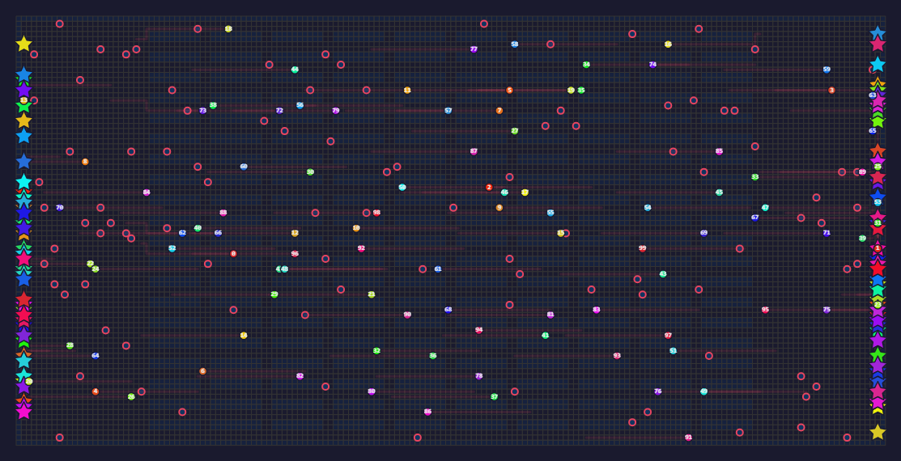
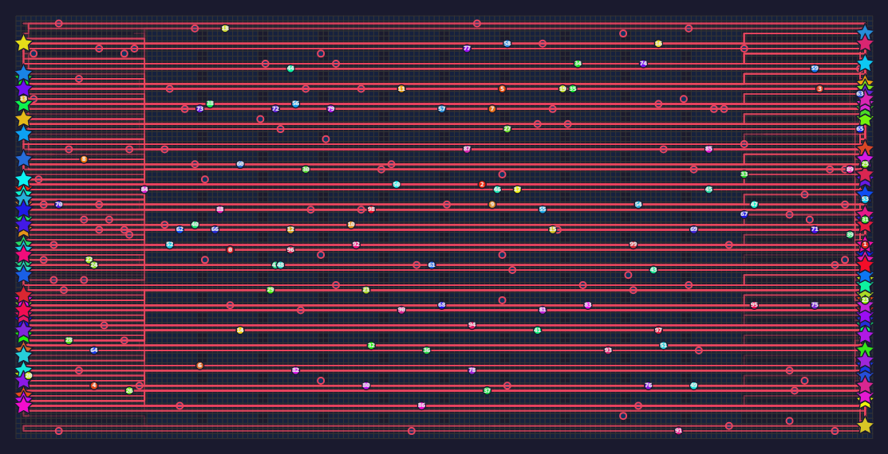
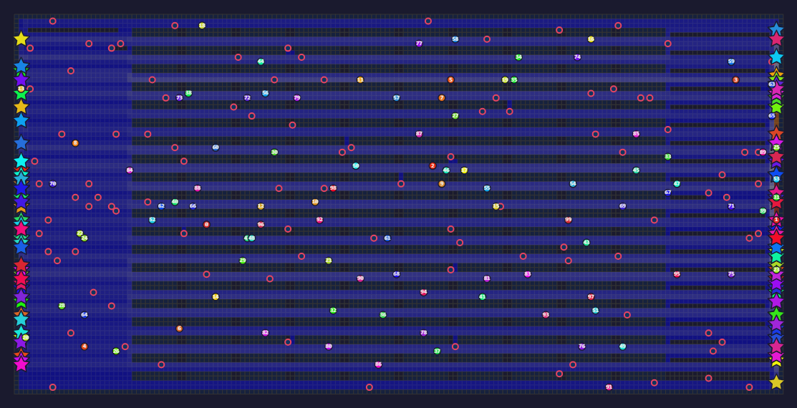
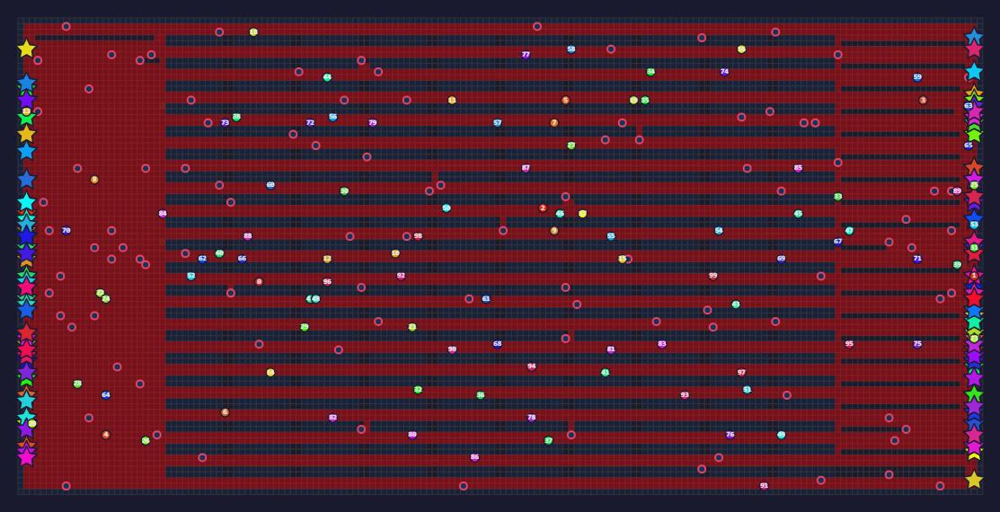

# MAPF Experiment Visualization Toolkit

Toolkit custom per visualizzazione, confronto e reporting di esperimenti Lifelong MAPF basati su RHCR.

## Indice
1. [Autori](#autori)
2. [Scopo](#scopo)
3. [Caratteristiche Principali](#caratteristiche-principali)
4. [Architettura del Toolkit](#architettura-del-toolkit)
5. [Struttura della Cartella](#struttura-della-cartella)
6. [Prerequisiti](#prerequisiti)
7. [Installazione](#installazione)
8. [Avvio Rapido](#avvio-rapido)
9. [Script Principali](#script-principali)
10. [Formato Dati Atteso](#formato-dati-atteso)
11. [Output Generati](#output-generati)
12. [Esempi Visivi](#esempi-visivi)
13. [Workflow Consigliati](#workflow-consigliati)
14. [Troubleshooting](#troubleshooting)
15. [Estensioni Future](#estensioni-future)
16. [Licenza](#licenza)

## Autori
- Piangatelli Jennifer
- Pavlovic Mattia

## Scopo
Questo modulo e stato sviluppato per supportare l'analisi sperimentale del progetto RHCR esteso, con particolare attenzione a:
- ispezione visiva delle traiettorie multi-agente nel tempo;
- confronto quantitativo tra run/solver;
- generazione di report HTML condivisibili;
- produzione batch di figure per tesi/report tecnici.

Il visualizer e una componente custom aggiunta in questa repository e non fa parte del codice RHCR originale.

Repository RHCR originale:
- https://github.com/Jiaoyang-Li/RHCR

## Caratteristiche Principali
- Viewer web interattivo con playback temporale.
- Overlay di heatmap (congestione, conflitti, velocita).
- Confronto multi-esperimento con tabelle e grafici.
- Report HTML automatici.
- Batch processing per export su insiemi estesi di esperimenti.

## Architettura del Toolkit
Pipeline logica:
1. Caricamento dati sperimentali (paths, config, mappa, metriche disponibili).
2. Calcolo metriche aggregate e indicatori spaziali.
3. Rendering interattivo o reportistica statica.

Componenti:
- Backend Python: parsing, metriche, orchestrazione export.
- Frontend HTML/JS: visualizzazione interattiva in browser.
- Plotting con matplotlib per confronti quantitativi.

Nota metodologica:
- Il visualizer e una estensione custom, ma mantiene la semantica originale RHCR
	dei parametri temporali `w` (planning horizon) e `h` (replanning period),
	senza alterarne il significato operativo.

## Struttura della Cartella
```text
visualizer/
|- visualize_experiment.py
|- compare_experiments.py
|- batch_process.py
|- test_export.py
|- requirements.txt
|- README.md
|- utils/
|  |- data_loader.py
|  |- metrics_calculator.py
|- templates/
|  |- viewer.html
|- static/
|  |- js/
|  |  |- viewer.js
|  |  |- ui.js
|  |- experiment_data.json
|- exports/
|  |- html/               # export standalone HTML (--export-html)
|  |- json/               # export JSON (--export-json)
|  |- video/              # export recorder HTML (--export-video)
|- thesis_figures/
```

## Prerequisiti
- Python 3.10+
- Dipendenze Python installabili via requirements
- Esperimenti gia disponibili in cartelle con output simulatore

## Installazione
Da [visualizer/](visualizer/):

```powershell
pip install -r requirements.txt
```

## Avvio Rapido
### Viewer interattivo (singolo esperimento)
```powershell
python visualize_experiment.py "..\exp\<cartella_esperimento>"
```

### Porta del viewer web
- Porta di default: `5000`
- Opzione CLI dedicata: `--port <numero_porta>`

Esempi:
```powershell
# Avvio su porta di default (5000)
python visualize_experiment.py "..\exp\<cartella_esperimento>"

# Avvio su porta personalizzata (es. 8080)
python visualize_experiment.py "..\exp\<cartella_esperimento>" --port 8080

# Avvio su porta personalizzata senza apertura automatica del browser
python visualize_experiment.py "..\exp\<cartella_esperimento>" --port 8080 --no-browser
```

URL atteso:
- default: `http://localhost:5000`
- custom: `http://localhost:<porta>`

### Export HTML standalone
```powershell
python visualize_experiment.py "..\exp\<cartella_esperimento>" --export-html viewer.html
```
Output:
- `visualizer/exports/html/viewer.html`

### Export HTML recorder video (WebM)
```powershell
python visualize_experiment.py "..\exp\<cartella_esperimento>" --export-video video_recorder.html
```
Output:
- `visualizer/exports/video/video_recorder.html`

### Export JSON dataset viewer
```powershell
python visualize_experiment.py "..\exp\<cartella_esperimento>" --export-json data.json
```
Output:
- `visualizer/exports/json/data.json`

### Confronto tra esperimenti
```powershell
python compare_experiments.py "..\exp\run1" "..\exp\run2" --output comparison_report.html
```

### Batch processing
```powershell
python batch_process.py --all --export-html --output-dir batch_output
```

## Script Principali
### 1) visualize_experiment.py
Funzione:
- avvia il viewer web per una singola run;
- consente navigazione temporale e overlay analitici;
- supporta export HTML offline;
- supporta export HTML con registratore browser per salvataggio video in WebM.

Input principali:
- percorso cartella esperimento.

Output principali:
- server locale (default localhost);
- file HTML standalone in `visualizer/exports/html/`;
- file JSON in `visualizer/exports/json/`;
- file HTML recorder video in `visualizer/exports/video/` (registrazione ed export .webm dal browser).

### 2) compare_experiments.py
Funzione:
- confronta piu esperimenti in parallelo;
- genera tabella metriche e grafici comparativi;
- produce report HTML finale.

Input principali:
- elenco cartelle esperimento oppure auto-detect per solver.

Output principali:
- comparison_report.html;
- cartella comparison_plots/ con PNG.

### 3) batch_process.py
Funzione:
- esecuzione batch su intere collezioni di esperimenti;
- export combinato HTML/JSON;
- supporto a figure per documentazione tecnica.

Input principali:
- selezione esperimenti (all/solver/cartella base);
- opzioni di export.

Output principali:
- report batch;
- cartelle con artefatti per singolo esperimento.

### 4) test_export.py
Funzione:
- script di verifica rapido per controllare la pipeline di export.

## Formato Dati Atteso
Ogni cartella esperimento dovrebbe contenere almeno i file necessari al loader.
In forma tipica:

```text
<experiment>/
|- paths.txt        # traiettorie agenti nel tempo
|- config.txt       # parametri run/solver
|- *.grid           # mappa (o riferimento equivalente)
|- solver.csv       # opzionale, statistiche per finestra
|- tasks.txt        # opzionale, info task
```

Note:
- la robustezza del parsing dipende dalla coerenza del formato file;
- in caso di campi mancanti, alcuni moduli possono degradare funzionalita o metriche.

## Output Generati
A seconda dello script, vengono prodotti:
- HTML interattivo standalone in `exports/html`;
- HTML con recorder video per export WebM in `exports/video`;
- JSON del dataset viewer in `exports/json`;
- report HTML di confronto;
- PNG dei grafici comparativi;
- figure aggregate in cartelle dedicate.

## Esempi Visivi
Di seguito alcuni esempi PNG del visualizer (cartella `visualizer/examples/`):

### Trails


### Planned Paths


### Heatmap - Congestion


### Heatmap - Velocity


## Workflow Consigliati
### Workflow A: Analisi visuale di una run
1. Eseguire [visualize_experiment.py](visualize_experiment.py).
2. Verificare traiettorie, conflitti e zone congestionate.
3. Esportare HTML per condivisione.
4. Se necessario, usare `--export-video` per registrare la simulazione e scaricare un file WebM.

### Workflow B: Confronto solver su stesso scenario
1. Selezionare run omogenee (stessa mappa/scenario, solver diversi).
2. Eseguire [compare_experiments.py](compare_experiments.py).
3. Analizzare report tabellare e grafici.

### Workflow C: Campagna estesa
1. Preparare directory di run in exp.
2. Eseguire [batch_process.py](batch_process.py).
3. Archiviare output HTML/PNG/JSON per documentazione finale.

## Troubleshooting
### Errore: esperimento non trovato
- Verificare il path passato a CLI.
- Verificare che [paths.txt](paths.txt), [config.txt](config.txt) e mappa siano presenti.

### Errore import modulo utils
- Eseguire i comandi dalla cartella [visualizer/](visualizer/).
- Verificare ambiente Python attivo e dipendenze installate.

### Porta occupata per viewer
- Chiudere processi precedenti oppure rilanciare su una porta libera con `--port`.
- Esempio: `python visualize_experiment.py "..\exp\<cartella_esperimento>" --port 8080`

### Report senza grafici
- Controllare che [comparison_plots/](comparison_plots/) sia scrivibile.
- Verificare che matplotlib sia installato correttamente.

### Export video non disponibile
- Verificare di aver generato il file con `--export-video` (non `--export-html`).
- Aprire il file in `visualizer/exports/video/` con browser moderno (Chrome/Edge/Firefox recenti).
- Il formato nativo di download e WebM; per MP4 usare conversione esterna, ad esempio:
	`ffmpeg -i video.webm -c:v libx264 video.mp4`

### Dove trovo i file esportati?
- `--export-html <nomefile>` salva in `visualizer/exports/html/`.
- `--export-json <nomefile>` salva in `visualizer/exports/json/`.
- `--export-video <nomefile>` salva in `visualizer/exports/video/`.

## Estensioni Future
- Dashboard web consolidata multi-run con filtri per solver, mappa, `k`, seed e finestre (`w`,`h`).
- Evoluzione delle metriche da statiche a dinamiche: passaggio da indicatori solo geometrici della mappa (es. celle occupate/libere, ostacoli, percentuali) a statistiche dipendenti dall esperimento;
- Metriche custom aggiuntive (es. smoothness, fairness, idle ratio) con confronto diretto tra run.
- Supporto a dataset ampi con ottimizzazioni I/O, caching e caricamento progressivo.
- Miglioramento usabilita export video (`--export-video`):
	- preset di registrazione (quality/fps/speed) selezionabili da UI;
	- slider velocita e timeline dedicati nel recorder senza rigenerare il file HTML;
	- wizard guidato in 3 step (Play -> Record -> Download) con stato visuale chiaro;
	- naming automatico file output con solver, mappa e timestamp;
	- opzione post-export assistita per conversione WebM -> MP4.

## Licenza
Questo modulo visualizer ha una licenza dedicata:
- [LICENSE](LICENSE)

Nota di perimetro licenza:
- [NOTICE.md](NOTICE.md)

Per la licenza del progetto principale:
- [../license.md](../license.md)

Riferimento framework originale:
- https://github.com/Jiaoyang-Li/RHCR
